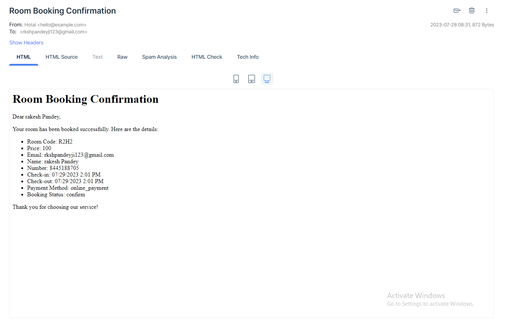

 
user: admin@example.com
password: 12345678

1: clone this rep.(git clone https://github.com/Rkshpandeyji/hotal_management.git)
2: after clone using this cmd composer install 
3: insert the sql file in your database 
4: after insert sql file run cmd php artisan serve '
5: do a booking 
5: booking payment method is 2 type 
    5:a=> cash
    5:b=> payment gateway 
6: using payment gatewaye (cord details: 4111 1111 1111 1111 , 02/25 , 231)
7: used smtp(mailtrap) for after confirm

8:if not avaible room function 
9: insert 2-hotal, 3-type, 6-room detail.
10: all room re only 5 
